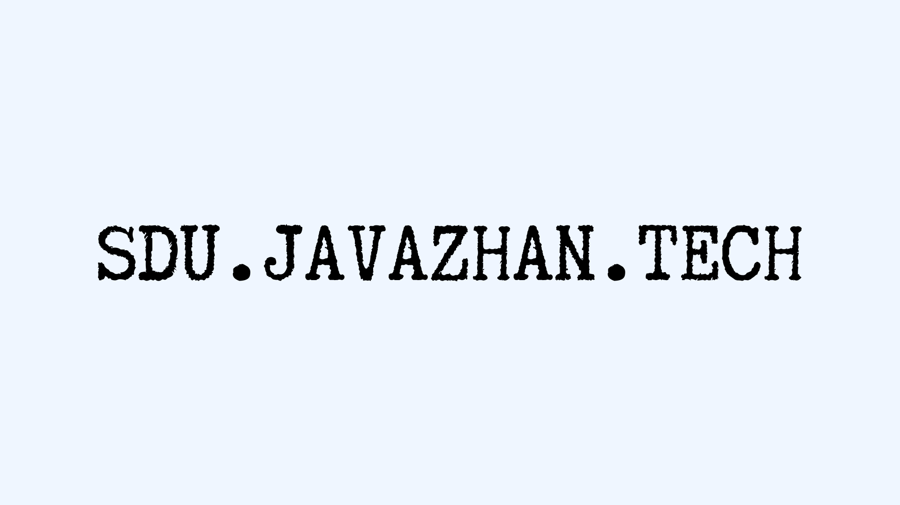

# Home

Конспекты по курсу **INF202 — Database Management Systems**.

Базируются на *Database System Concepts, 7th Ed.* (Silberschatz, Korth, Sudarshan).

> [!abstract] С чего начать
> Открой [[Lectures/index|индекс лекций]] — это карта всего курса с ссылками на 14 глав, mini-quiz и стратегией подготовки к финалу.

## Lectures

- [[Lectures/index|📚 Все лекции — INF202 Database Management Systems]]

### Quick links

- [[Lectures/01-introduction-to-databases|01 — Introduction to Databases]]
- [[Lectures/02-relational-model|02 — Relational Model]]
- [[Lectures/03-sql-basics|03 — SQL Basics]]
- [[Lectures/04-intermediate-sql|04 — Intermediate SQL]]
- [[Lectures/05-advanced-sql|05 — Advanced SQL]]
- [[Lectures/06-er-model|06 — ER Model]]
- [[Lectures/07-normalization|07 — Normalization]]
- [[Lectures/08-complex-data-types|08 — Complex Data Types]]
- [[Lectures/09-application-development|09 — Application Development]]
- [[Lectures/10-physical-storage|10 — Physical Storage]]
- [[Lectures/11-data-storage-structures|11 — Data Storage Structures]]
- [[Lectures/12-indexing|12 — Indexing]]
- [[Lectures/13-query-processing|13 — Query Processing & Optimization]]
- [[Lectures/14-transactions|14 — Transactions]]

## Practice — Quizzes

> [!tip] 420 вопросов с ответами
> К каждой лекции — 30 multiple-choice вопросов с объяснениями.
> Главный проект: [sdu.javazhan.tech/questions/7](https://sdu.javazhan.tech/questions/7)

## Student Help

- [[sdu-javazhan-tech/index|SDU.JAVAZHAN.TECH — Telegram-бот для студентов SDU]]
- [sdu.javazhan.tech](https://sdu.javazhan.tech)

**SDU.JAVAZHAN.TECH** — бот, который следит за оценками, ловит квоты и напоминает о дедлайнах. Бесплатно.

> [!tip] Стратегия за 7 дней до финала
> День 1-2: 01 → 05 (модель + SQL).
> День 3: 06 + 07 (ER + normalization).
> День 4: 08 + 09 (complex types + application).
> День 5: 10 + 11 + 12 (storage + indexing).
> День 6: 13 + 14 (query processing + transactions).
> День 7: повторение mini-quiz, проблемные места.
